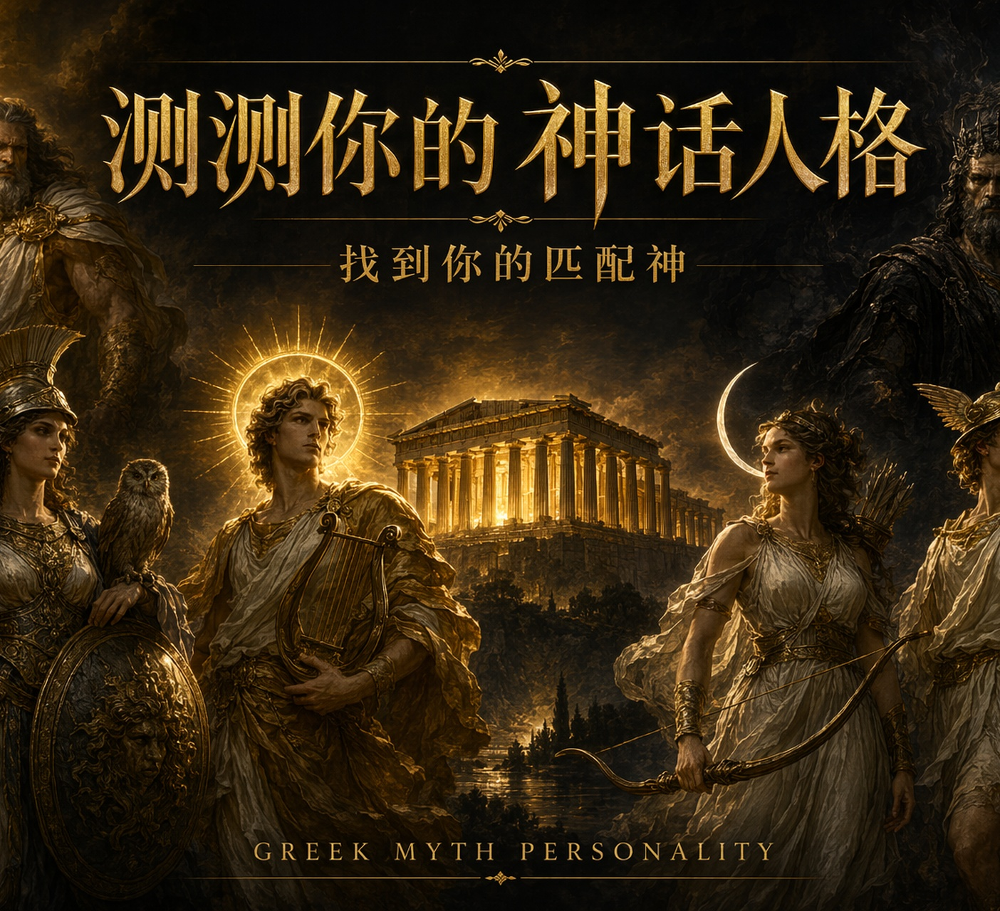

# 神谕 · 你是哪位希腊神？

> 十道命运之问，揭开灵魂深处的神话原型。


---

## 关于这个项目

我们每个人身上，都住着一位古老的神祇——有人生来是宙斯式的领袖，有人是雅典娜式的智者，有人是狄俄尼索斯式的自由灵魂。希腊神话用了几千年，把人性刻成了二十个永恒的形象。

这个测试想做的，就是找到你是哪一个。

**🎮 在线体验 → [https://yakultyum.github.io/Greek-mythology-personality-test/](https://yakultyum.github.io/Greek-mythology-personality-test/)**

---

## 功能

- **20 位神祇** · 宙斯、雅典娜、哈迪斯、阿芙罗狄忒……完整奥林匹斯阵容
- **10 道命运之问** · 每题配 AI 生成油画场景图
- **6 维人格数据** · 权威 / 智慧 / 激情 / 自由 / 深沉 / 守护
- **190 段命运羁绊** · 基于余弦相似度算法，每位神祇与其他 19 位的专属关系描述
- **好友对比** · 生成专属邀请链接，解锁你们的神话关系故事

---

## 技术

- 纯原生 HTML / CSS / JS，单文件，无依赖，无框架
- REM 适配方案（750px 设计稿基准，JS 动态根字号）
- AI 生成羊皮纸质感背景 + 油画场景插图
- 余弦相似度算法计算神祇人格匹配度

---

## 截图

| 首页 | 答题页 | 结果页 |
|------|--------|--------|
|  | 十道命运之问 | 专属神祇人格 |

---

## 本地运行

直接用浏览器打开 `index.html` 即可，或启动一个本地服务器：

```bash
npx serve .
```

然后访问 `http://localhost:3000`

---

*神话是最古老的镜子，照见的是你。*
